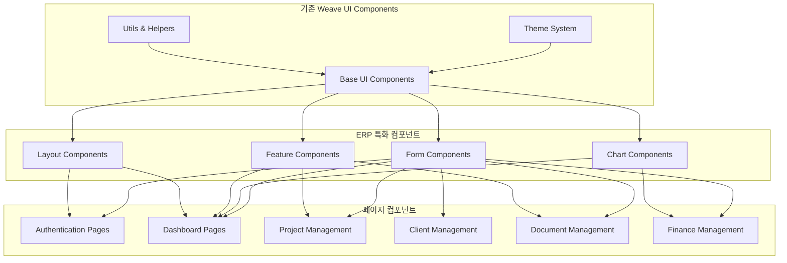

# Weave ERP 컴포넌트 설계 및 페이지 구조

## 📋 개요

기존 Weave UI 컴포넌트 라이브러리를 확장하여 ERP 시스템에 특화된 컴포넌트들을 설계하고, 사용자 시나리오에 기반한 페이지 구조를 정의합니다.

## 🏗️ 컴포넌트 아키텍처



## 🧩 컴포넌트 계층 구조

### 1. 기존 UI 컴포넌트 확장

기존 Weave UI 컴포넌트를 ERP 요구사항에 맞게 확장합니다.

```typescript
// src/components/ui/enhanced/
├── DataTable/              # 고급 테이블 컴포넌트
│   ├── DataTable.tsx
│   ├── DataTableHeader.tsx
│   ├── DataTableRow.tsx
│   ├── DataTableCell.tsx
│   ├── DataTablePagination.tsx
│   └── types.ts
├── DatePicker/             # 날짜 선택 컴포넌트
│   ├── DatePicker.tsx
│   ├── DateRangePicker.tsx
│   └── Calendar.tsx
├── FileUpload/             # 파일 업로드 컴포넌트
│   ├── FileUpload.tsx
│   ├── DropZone.tsx
│   ├── FilePreview.tsx
│   └── ProgressBar.tsx
├── FormFields/             # 고급 폼 필드
│   ├── CurrencyInput.tsx
│   ├── PhoneInput.tsx
│   ├── AddressInput.tsx
│   └── BusinessNumberInput.tsx
└── Modal/                  # 모달 시스템
    ├── Modal.tsx
    ├── ConfirmDialog.tsx
    ├── FormModal.tsx
    └── FullscreenModal.tsx
```

### 2. ERP 특화 컴포넌트

```typescript
// src/components/features/
├── dashboard/              # 대시보드 컴포넌트
│   ├── MetricCard.tsx
│   ├── RevenueChart.tsx
│   ├── ProjectStatusChart.tsx
│   ├── RecentActivities.tsx
│   ├── QuickActions.tsx
│   └── KPIWidget.tsx
├── kanban/                 # 칸반 보드
│   ├── KanbanBoard.tsx
│   ├── KanbanColumn.tsx
│   ├── KanbanCard.tsx
│   ├── TaskCard.tsx
│   └── DragDropProvider.tsx
├── document-editor/        # 문서 편집기
│   ├── DocumentEditor.tsx
│   ├── TemplateSelector.tsx
│   ├── RichTextEditor.tsx
│   ├── PDFPreview.tsx
│   └── SignaturePad.tsx
├── ai-assistant/           # AI 어시스턴트
│   ├── AiChat.tsx
│   ├── DocumentGenerator.tsx
│   ├── SummaryGenerator.tsx
│   └── SuggestionPanel.tsx
├── client-sharing/         # 클라이언트 공유
│   ├── ShareLinkGenerator.tsx
│   ├── UploadProgress.tsx
│   ├── FileManager.tsx
│   └── ShareSettings.tsx
└── finance/                # 재무 관리
    ├── InvoicePreview.tsx
    ├── PaymentTracker.tsx
    ├── TaxCalculator.tsx
    └── ExpenseTracker.tsx
```

## 📄 페이지 구조 설계

### 1. 인증 페이지 (`/app/(auth)/`)

```typescript
// 로그인 페이지
interface LoginPageProps {}

const LoginPage: React.FC<LoginPageProps> = () => {
  return (
    <AuthLayout>
      <div className="min-h-screen flex items-center justify-center">
        <Card className="w-full max-w-md">
          <CardHeader>
            <h1 className="text-2xl font-bold text-center">Weave에 로그인</h1>
            <p className="text-center text-text-secondary">
              프리랜서를 위한 올인원 워크스페이스
            </p>
          </CardHeader>
          <CardContent>
            <LoginForm />
            <SocialLoginButtons />
          </CardContent>
          <CardFooter>
            <p className="text-center text-sm">
              계정이 없으신가요?{' '}
              <Link href="/register" className="text-primary">
                회원가입
              </Link>
            </p>
          </CardFooter>
        </Card>
      </div>
    </AuthLayout>
  )
}

// 회원가입 페이지
const RegisterPage: React.FC = () => {
  return (
    <AuthLayout>
      <div className="min-h-screen flex items-center justify-center">
        <Card className="w-full max-w-md">
          <CardHeader>
            <h1 className="text-2xl font-bold text-center">Weave 시작하기</h1>
          </CardHeader>
          <CardContent>
            <RegistrationForm />
          </CardContent>
        </Card>
      </div>
    </AuthLayout>
  )
}
```

### 2. 메인 대시보드 (`/app/(dashboard)/dashboard/`)

```typescript
interface DashboardPageProps {
  searchParams: {
    period?: string
    view?: 'cards' | 'chart'
  }
}

const DashboardPage: React.FC<DashboardPageProps> = ({ searchParams }) => {
  return (
    <DashboardLayout>
      <div className="space-y-6">
        {/* 헤더 영역 */}
        <div className="flex justify-between items-center">
          <div>
            <h1 className="text-3xl font-bold">대시보드</h1>
            <p className="text-text-secondary">오늘의 비즈니스 현황을 한눈에</p>
          </div>
          <div className="flex gap-2">
            <DateRangePicker />
            <Button variant="primary" icon={<Plus />}>
              새 프로젝트
            </Button>
          </div>
        </div>

        {/* KPI 카드 영역 */}
        <div className="grid grid-cols-1 md:grid-cols-2 lg:grid-cols-4 gap-6">
          <MetricCard
            title="이번 달 수입"
            value="₩2,450,000"
            change="+12.5%"
            trend="up"
            icon={<TrendingUp />}
          />
          <MetricCard
            title="진행 중인 프로젝트"
            value="7개"
            change="+2개"
            trend="up"
            icon={<FolderOpen />}
          />
          <MetricCard
            title="미수금"
            value="₩850,000"
            change="-₩200,000"
            trend="down"
            icon={<Clock />}
          />
          <MetricCard
            title="완료율"
            value="92%"
            change="+5%"
            trend="up"
            icon={<CheckCircle />}
          />
        </div>

        {/* 차트 영역 */}
        <div className="grid grid-cols-1 lg:grid-cols-2 gap-6">
          <Card>
            <CardHeader>
              <h3 className="text-lg font-semibold">월별 수입 현황</h3>
            </CardHeader>
            <CardContent>
              <RevenueChart period={searchParams.period} />
            </CardContent>
          </Card>
          
          <Card>
            <CardHeader>
              <h3 className="text-lg font-semibold">프로젝트 상태</h3>
            </CardHeader>
            <CardContent>
              <ProjectStatusChart />
            </CardContent>
          </Card>
        </div>

        {/* 최근 활동 & 빠른 작업 */}
        <div className="grid grid-cols-1 lg:grid-cols-3 gap-6">
          <div className="lg:col-span-2">
            <Card>
              <CardHeader>
                <h3 className="text-lg font-semibold">최근 활동</h3>
              </CardHeader>
              <CardContent>
                <RecentActivities limit={10} />
              </CardContent>
            </Card>
          </div>
          
          <Card>
            <CardHeader>
              <h3 className="text-lg font-semibold">빠른 작업</h3>
            </CardHeader>
            <CardContent>
              <QuickActions />
            </CardContent>
          </Card>
        </div>
      </div>
    </DashboardLayout>
  )
}
```

### 3. 프로젝트 관리 (`/app/(dashboard)/projects/`)

```typescript
// 프로젝트 목록 페이지
interface ProjectsPageProps {
  searchParams: {
    status?: ProjectStatus
    client?: string
    sort?: string
    view?: 'list' | 'kanban' | 'calendar'
  }
}

const ProjectsPage: React.FC<ProjectsPageProps> = ({ searchParams }) => {
  const { view = 'kanban' } = searchParams

  return (
    <DashboardLayout>
      <div className="space-y-6">
        {/* 헤더 */}
        <div className="flex justify-between items-center">
          <div>
            <h1 className="text-3xl font-bold">프로젝트</h1>
            <p className="text-text-secondary">모든 프로젝트를 효율적으로 관리하세요</p>
          </div>
          <Button variant="primary" onClick={() => setShowCreateModal(true)}>
            새 프로젝트
          </Button>
        </div>

        {/* 필터 & 뷰 선택 */}
        <div className="flex justify-between items-center">
          <div className="flex gap-4">
            <Select value={searchParams.status} onValueChange={handleStatusFilter}>
              <SelectTrigger>
                <SelectValue placeholder="상태 선택" />
              </SelectTrigger>
              <SelectContent>
                <SelectItem value="all">모든 상태</SelectItem>
                <SelectItem value="PENDING">진행 전</SelectItem>
                <SelectItem value="IN_PROGRESS">진행 중</SelectItem>
                <SelectItem value="FEEDBACK">피드백</SelectItem>
                <SelectItem value="COMPLETED">완료</SelectItem>
              </SelectContent>
            </Select>
            
            <ClientFilter />
            <DateRangeFilter />
          </div>
          
          <ViewToggle 
            value={view}
            options={['kanban', 'list', 'calendar']}
            onChange={handleViewChange}
          />
        </div>

        {/* 컨텐츠 영역 */}
        {view === 'kanban' && <ProjectKanbanBoard />}
        {view === 'list' && <ProjectDataTable />}
        {view === 'calendar' && <ProjectCalendar />}
      </div>
    </DashboardLayout>
  )
}

// 프로젝트 상세 페이지
interface ProjectDetailPageProps {
  params: { id: string }
}

const ProjectDetailPage: React.FC<ProjectDetailPageProps> = ({ params }) => {
  return (
    <DashboardLayout>
      <div className="space-y-6">
        {/* 프로젝트 헤더 */}
        <ProjectHeader projectId={params.id} />
        
        {/* 탭 네비게이션 */}
        <Tabs defaultValue="overview">
          <TabsList>
            <TabsTrigger value="overview">개요</TabsTrigger>
            <TabsTrigger value="tasks">작업</TabsTrigger>
            <TabsTrigger value="files">파일</TabsTrigger>
            <TabsTrigger value="time">시간 추적</TabsTrigger>
            <TabsTrigger value="documents">문서</TabsTrigger>
            <TabsTrigger value="activity">활동</TabsTrigger>
          </TabsList>
          
          <TabsContent value="overview">
            <ProjectOverview projectId={params.id} />
          </TabsContent>
          
          <TabsContent value="tasks">
            <TaskManagement projectId={params.id} />
          </TabsContent>
          
          <TabsContent value="files">
            <FileManagement projectId={params.id} />
          </TabsContent>
          
          <TabsContent value="time">
            <TimeTracking projectId={params.id} />
          </TabsContent>
          
          <TabsContent value="documents">
            <ProjectDocuments projectId={params.id} />
          </TabsContent>
          
          <TabsContent value="activity">
            <ActivityFeed projectId={params.id} />
          </TabsContent>
        </Tabs>
      </div>
    </DashboardLayout>
  )
}
```

### 4. 클라이언트 관리 (`/app/(dashboard)/clients/`)

```typescript
// 클라이언트 목록 페이지
const ClientsPage: React.FC = () => {
  return (
    <DashboardLayout>
      <div className="space-y-6">
        <div className="flex justify-between items-center">
          <div>
            <h1 className="text-3xl font-bold">클라이언트</h1>
            <p className="text-text-secondary">고객 정보와 프로젝트 히스토리를 관리하세요</p>
          </div>
          <Button variant="primary">새 클라이언트 추가</Button>
        </div>

        {/* 검색 및 필터 */}
        <div className="flex gap-4">
          <div className="flex-1">
            <Input 
              placeholder="클라이언트 검색..."
              icon={<Search />}
            />
          </div>
          <Select>
            <SelectTrigger className="w-48">
              <SelectValue placeholder="상태 필터" />
            </SelectTrigger>
            <SelectContent>
              <SelectItem value="all">모든 상태</SelectItem>
              <SelectItem value="ACTIVE">활성</SelectItem>
              <SelectItem value="INACTIVE">비활성</SelectItem>
            </SelectContent>
          </Select>
        </div>

        {/* 클라이언트 그리드 */}
        <div className="grid grid-cols-1 md:grid-cols-2 lg:grid-cols-3 gap-6">
          {clients.map(client => (
            <ClientCard key={client.id} client={client} />
          ))}
        </div>
      </div>
    </DashboardLayout>
  )
}

// 클라이언트 상세 페이지
const ClientDetailPage: React.FC<{ params: { id: string } }> = ({ params }) => {
  return (
    <DashboardLayout>
      <div className="space-y-6">
        <ClientHeader clientId={params.id} />
        
        <Tabs defaultValue="overview">
          <TabsList>
            <TabsTrigger value="overview">개요</TabsTrigger>
            <TabsTrigger value="projects">프로젝트</TabsTrigger>
            <TabsTrigger value="documents">문서</TabsTrigger>
            <TabsTrigger value="invoices">청구서</TabsTrigger>
            <TabsTrigger value="files">파일</TabsTrigger>
          </TabsList>
          
          <TabsContent value="overview">
            <ClientOverview clientId={params.id} />
          </TabsContent>
          
          <TabsContent value="projects">
            <ClientProjects clientId={params.id} />
          </TabsContent>
          
          <TabsContent value="documents">
            <ClientDocuments clientId={params.id} />
          </TabsContent>
          
          <TabsContent value="invoices">
            <ClientInvoices clientId={params.id} />
          </TabsContent>
          
          <TabsContent value="files">
            <ClientFiles clientId={params.id} />
          </TabsContent>
        </Tabs>
      </div>
    </DashboardLayout>
  )
}
```

### 5. 문서 관리 (`/app/(dashboard)/documents/`)

```typescript
// 문서 목록 페이지
const DocumentsPage: React.FC = () => {
  return (
    <DashboardLayout>
      <div className="space-y-6">
        <div className="flex justify-between items-center">
          <div>
            <h1 className="text-3xl font-bold">문서</h1>
            <p className="text-text-secondary">견적서, 계약서, 청구서를 관리하세요</p>
          </div>
          <DropdownMenu>
            <DropdownMenuTrigger asChild>
              <Button variant="primary">
                새 문서 작성 <ChevronDown className="ml-2 h-4 w-4" />
              </Button>
            </DropdownMenuTrigger>
            <DropdownMenuContent>
              <DropdownMenuItem onClick={() => createDocument('QUOTE')}>
                견적서
              </DropdownMenuItem>
              <DropdownMenuItem onClick={() => createDocument('CONTRACT')}>
                계약서
              </DropdownMenuItem>
              <DropdownMenuItem onClick={() => createDocument('INVOICE')}>
                청구서
              </DropdownMenuItem>
            </DropdownMenuContent>
          </DropdownMenu>
        </div>

        {/* 필터 및 검색 */}
        <div className="flex gap-4">
          <DocumentTypeFilter />
          <DocumentStatusFilter />
          <DateRangeFilter />
          <Input placeholder="문서 검색..." className="flex-1" />
        </div>

        {/* 문서 테이블 */}
        <DocumentDataTable />
      </div>
    </DashboardLayout>
  )
}

// 문서 편집기 페이지
const DocumentEditorPage: React.FC<{ params: { id: string } }> = ({ params }) => {
  return (
    <div className="h-screen flex">
      {/* 편집 패널 */}
      <div className="flex-1 flex flex-col">
        <DocumentEditorHeader documentId={params.id} />
        <div className="flex-1 grid grid-cols-2">
          <DocumentEditor documentId={params.id} />
          <DocumentPreview documentId={params.id} />
        </div>
      </div>
      
      {/* 사이드 패널 */}
      <div className="w-80 border-l border-border">
        <DocumentSidebar documentId={params.id} />
      </div>
    </div>
  )
}
```

### 6. 클라이언트 공유 페이지 (`/app/share/`)

```typescript
// 토큰 기반 파일 업로드 페이지
interface SharePageProps {
  params: { token: string }
}

const SharePage: React.FC<SharePageProps> = ({ params }) => {
  const { data: shareInfo, isLoading } = useShareToken(params.token)

  if (isLoading) {
    return <LoadingSpinner />
  }

  if (!shareInfo || !shareInfo.is_active) {
    return <TokenExpiredPage />
  }

  return (
    <div className="min-h-screen bg-gray-50">
      <div className="container mx-auto py-12">
        <Card className="max-w-2xl mx-auto">
          <CardHeader className="text-center">
            <h1 className="text-2xl font-bold">{shareInfo.name}</h1>
            {shareInfo.description && (
              <p className="text-text-secondary">{shareInfo.description}</p>
            )}
            {shareInfo.project && (
              <Badge variant="secondary">
                프로젝트: {shareInfo.project.title}
              </Badge>
            )}
          </CardHeader>
          
          <CardContent>
            <FileUploadZone 
              token={params.token}
              maxFiles={shareInfo.max_files}
              maxSizeMs={shareInfo.max_size_mb}
              allowedTypes={shareInfo.allowed_types}
              onUploadComplete={handleUploadComplete}
            />
            
            {/* 업로드된 파일 목록 */}
            <UploadedFilesList token={params.token} />
          </CardContent>
          
          <CardFooter className="text-center text-sm text-text-secondary">
            {shareInfo.expires_at && (
              <p>
                만료일: {new Date(shareInfo.expires_at).toLocaleDateString()}
              </p>
            )}
          </CardFooter>
        </Card>
      </div>
    </div>
  )
}
```

## 🎨 디자인 시스템 확장

### 1. 컬러 팔레트 확장

기존 Weave UI 테마 시스템을 ERP에 맞게 확장합니다.

```typescript
// src/lib/theme/erp-colors.ts
export const erpColors = {
  status: {
    pending: '#F59E0B',      // 대기 중
    inProgress: '#3B82F6',   // 진행 중
    completed: '#10B981',    // 완료
    cancelled: '#EF4444',    // 취소됨
    overdue: '#DC2626',      // 연체
  },
  finance: {
    income: '#059669',       // 수입
    expense: '#DC2626',      // 지출
    profit: '#0D9488',       // 수익
    loss: '#B91C1C',        // 손실
  },
  priority: {
    low: '#6B7280',         // 낮음
    medium: '#F59E0B',      // 보통
    high: '#EF4444',        // 높음
    urgent: '#DC2626',      // 긴급
  }
}

// 기존 테마에 추가
export const extendedTheme = {
  ...THEME_CONSTANTS,
  colors: {
    ...THEME_CONSTANTS.colors,
    ...erpColors
  }
}
```

### 2. 아이콘 시스템

```typescript
// src/components/ui/icons/
export const ERPIcons = {
  // 프로젝트 관련
  Project: () => <FolderOpen className="w-5 h-5" />,
  Task: () => <CheckSquare className="w-5 h-5" />,
  Timeline: () => <Calendar className="w-5 h-5" />,
  
  // 클라이언트 관련
  Client: () => <Users className="w-5 h-5" />,
  Contact: () => <User className="w-5 h-5" />,
  
  // 문서 관련
  Document: () => <FileText className="w-5 h-5" />,
  Quote: () => <Receipt className="w-5 h-5" />,
  Contract: () => <FileSignature className="w-5 h-5" />,
  Invoice: () => <CreditCard className="w-5 h-5" />,
  
  // 재무 관련
  Revenue: () => <TrendingUp className="w-5 h-5" />,
  Expense: () => <TrendingDown className="w-5 h-5" />,
  Tax: () => <Calculator className="w-5 h-5" />,
  
  // 상태 관련
  Pending: () => <Clock className="w-5 h-5 text-status-pending" />,
  InProgress: () => <Play className="w-5 h-5 text-status-inProgress" />,
  Completed: () => <CheckCircle className="w-5 h-5 text-status-completed" />,
  Cancelled: () => <XCircle className="w-5 h-5 text-status-cancelled" />,
}
```

## 📱 반응형 디자인

### 1. 브레이크포인트 전략

```typescript
// src/lib/responsive.ts
export const breakpoints = {
  mobile: '320px',     // 모바일
  tablet: '768px',     // 태블릿
  desktop: '1024px',   // 데스크톱
  wide: '1280px',      // 와이드 스크린
}

export const responsive = {
  // 모바일: 단일 컬럼, 간소화된 네비게이션
  mobile: {
    sidebar: 'overlay',      // 오버레이 사이드바
    table: 'card',          // 테이블을 카드로 변환
    chart: 'simplified',    // 차트 단순화
  },
  
  // 태블릿: 적응형 레이아웃
  tablet: {
    sidebar: 'collapsible', // 접을 수 있는 사이드바
    table: 'responsive',    // 반응형 테이블
    chart: 'standard',      // 표준 차트
  },
  
  // 데스크톱: 전체 기능
  desktop: {
    sidebar: 'fixed',       // 고정 사이드바
    table: 'full',          // 전체 테이블
    chart: 'advanced',      // 고급 차트
  }
}
```

### 2. 모바일 최적화

```typescript
// src/components/layout/MobileLayout.tsx
const MobileLayout: React.FC<{ children: React.ReactNode }> = ({ children }) => {
  return (
    <div className="min-h-screen bg-background">
      {/* 모바일 헤더 */}
      <MobileHeader />
      
      {/* 메인 컨텐츠 */}
      <main className="pb-16">
        {children}
      </main>
      
      {/* 하단 네비게이션 */}
      <MobileBottomNav />
      
      {/* 플로팅 액션 버튼 */}
      <FloatingActionButton />
    </div>
  )
}

// 하단 네비게이션
const MobileBottomNav: React.FC = () => {
  return (
    <nav className="fixed bottom-0 left-0 right-0 bg-white border-t border-border">
      <div className="flex">
        <NavItem icon={<Home />} label="홈" href="/dashboard" />
        <NavItem icon={<FolderOpen />} label="프로젝트" href="/projects" />
        <NavItem icon={<Users />} label="클라이언트" href="/clients" />
        <NavItem icon={<FileText />} label="문서" href="/documents" />
        <NavItem icon={<BarChart />} label="리포트" href="/finance" />
      </div>
    </nav>
  )
}
```

## 🔧 상태 관리 아키텍처

### 1. Zustand 스토어 설계

```typescript
// src/stores/projectStore.ts
interface ProjectStore {
  // 상태
  projects: Project[]
  currentProject: Project | null
  isLoading: boolean
  filters: ProjectFilters
  
  // 액션
  fetchProjects: () => Promise<void>
  createProject: (data: CreateProjectData) => Promise<Project>
  updateProject: (id: string, data: UpdateProjectData) => Promise<void>
  deleteProject: (id: string) => Promise<void>
  setCurrentProject: (project: Project | null) => void
  updateFilters: (filters: Partial<ProjectFilters>) => void
  
  // 셀렉터
  getProjectsByStatus: (status: ProjectStatus) => Project[]
  getOverdueProjects: () => Project[]
  getProjectMetrics: () => ProjectMetrics
}

// src/stores/uiStore.ts
interface UIStore {
  // 레이아웃 상태
  sidebarCollapsed: boolean
  mobileMenuOpen: boolean
  
  // 모달 상태
  modals: Record<string, boolean>
  
  // 테마 상태
  theme: 'dark' | 'light'
  
  // 액션
  toggleSidebar: () => void
  toggleMobileMenu: () => void
  openModal: (modalId: string) => void
  closeModal: (modalId: string) => void
  setTheme: (theme: 'dark' | 'light') => void
}
```

### 2. React Query 통합

```typescript
// src/hooks/useProjects.ts
export function useProjects(filters?: ProjectFilters) {
  return useQuery({
    queryKey: ['projects', filters],
    queryFn: () => fetchProjects(filters),
    staleTime: 5 * 60 * 1000, // 5분
    cacheTime: 10 * 60 * 1000, // 10분
  })
}

export function useCreateProject() {
  const queryClient = useQueryClient()
  
  return useMutation({
    mutationFn: createProject,
    onSuccess: () => {
      queryClient.invalidateQueries(['projects'])
      queryClient.invalidateQueries(['dashboard'])
    },
  })
}
```

## 🚀 성능 최적화 전략

### 1. 컴포넌트 최적화

```typescript
// 메모이제이션 활용
const ProjectCard = memo(({ project }: { project: Project }) => {
  return (
    <Card>
      <CardContent>
        {/* 프로젝트 카드 내용 */}
      </CardContent>
    </Card>
  )
})

// 가상화 적용 (대용량 리스트)
const ProjectList = ({ projects }: { projects: Project[] }) => {
  return (
    <FixedSizeList
      height={600}
      itemCount={projects.length}
      itemSize={120}
      itemData={projects}
    >
      {ProjectListItem}
    </FixedSizeList>
  )
}
```

### 2. 번들 최적화

```typescript
// 동적 import로 코드 스플리팅
const DocumentEditor = lazy(() => import('@/components/features/document-editor/DocumentEditor'))
const KanbanBoard = lazy(() => import('@/components/features/kanban/KanbanBoard'))
const RevenueChart = lazy(() => import('@/components/features/dashboard/RevenueChart'))

// 조건부 로딩
const ConditionalComponent = ({ shouldLoad }: { shouldLoad: boolean }) => {
  if (!shouldLoad) return null
  
  return (
    <Suspense fallback={<Skeleton />}>
      <DocumentEditor />
    </Suspense>
  )
}
```

## 📝 다음 단계

1. **컴포넌트 구현 시작** - 기본 UI 컴포넌트부터 순차적 구현
2. **스토리북 설정** - 컴포넌트 문서화 및 테스트 환경 구축  
3. **API 클라이언트 구현** - 데이터 페칭 로직 구현
4. **테스트 환경 구축** - Jest + Testing Library 설정
5. **CI/CD 파이프라인** - 자동화된 테스트 및 배포 설정

이 컴포넌트 설계는 사용자 시나리오를 기반으로 실용적이고 확장 가능한 구조로 설계되었으며, 기존 Weave UI 시스템의 장점을 최대한 활용할 수 있도록 구성되었습니다.