# Weave ERP 데이터베이스 스키마 설계

## 📋 개요

React + Next.js + Supabase 조합으로 구현되는 Weave ERP 시스템의 데이터베이스 스키마를 설계합니다. 기존 도메인 모델을 기반으로 PostgreSQL + Prisma ORM을 활용한 확장 가능한 구조로 설계되었습니다.

## 🏗️ 데이터베이스 아키텍처



## 📊 Prisma 스키마 정의

```prisma
// schema.prisma
generator client {
  provider = "prisma-client-js"
}

datasource db {
  provider = "postgresql"
  url      = env("DATABASE_URL")
}

// ===== 사용자 및 인증 =====
model User {
  id              String    @id @default(cuid())
  email           String    @unique
  created_at      DateTime  @default(now())
  updated_at      DateTime  @updatedAt
  
  // Supabase Auth와 연동
  auth_id         String?   @unique // Supabase user.id
  
  // 관계
  profile         Profile?
  clients         Client[]
  projects        Project[]
  documents       Document[]
  invoices        Invoice[]
  transactions    Transaction[]
  tax_calculations TaxCalculation[]
  file_uploads    FileUpload[]
  ai_generations  AiGeneration[]
  share_tokens    ShareToken[]
  
  @@map("users")
}

model Profile {
  id              String    @id @default(cuid())
  user_id         String    @unique
  name            String?
  business_name   String?
  phone           String?
  business_number String?   // 사업자등록번호
  address         String?
  profile_image   String?
  timezone        String    @default("Asia/Seoul")
  currency        String    @default("KRW")
  created_at      DateTime  @default(now())
  updated_at      DateTime  @updatedAt
  
  // 관계
  user            User      @relation(fields: [user_id], references: [id], onDelete: Cascade)
  
  @@map("profiles")
}

// ===== 클라이언트 관리 =====
model Client {
  id              String    @id @default(cuid())
  user_id         String
  company_name    String
  business_number String?
  address         String?
  notes           String?
  status          ClientStatus @default(ACTIVE)
  created_at      DateTime  @default(now())
  updated_at      DateTime  @updatedAt
  
  // 관계
  user            User      @relation(fields: [user_id], references: [id], onDelete: Cascade)
  contacts        ClientContact[]
  projects        Project[]
  documents       Document[]
  invoices        Invoice[]
  file_uploads    FileUpload[]
  ai_generations  AiGeneration[]
  
  @@map("clients")
  @@index([user_id])
}

model ClientContact {
  id              String    @id @default(cuid())
  client_id       String
  name            String
  email           String?
  phone           String?
  position        String?
  is_primary      Boolean   @default(false)
  created_at      DateTime  @default(now())
  updated_at      DateTime  @updatedAt
  
  // 관계
  client          Client    @relation(fields: [client_id], references: [id], onDelete: Cascade)
  
  @@map("client_contacts")
  @@index([client_id])
}

enum ClientStatus {
  ACTIVE
  INACTIVE
  ARCHIVED
}

// ===== 프로젝트 관리 =====
model Project {
  id              String    @id @default(cuid())
  user_id         String
  client_id       String?
  title           String
  description     String?
  status          ProjectStatus @default(PENDING)
  priority        ProjectPriority @default(MEDIUM)
  budget          Decimal?  @db.Decimal(12, 2)
  currency        String    @default("KRW")
  start_date      DateTime?
  end_date        DateTime?
  actual_end_date DateTime?
  progress        Int       @default(0) // 0-100
  created_at      DateTime  @default(now())
  updated_at      DateTime  @updatedAt
  
  // 관계
  user            User      @relation(fields: [user_id], references: [id], onDelete: Cascade)
  client          Client?   @relation(fields: [client_id], references: [id], onDelete: SetNull)
  tasks           ProjectTask[]
  documents       Document[]
  invoices        Invoice[]
  time_entries    TimeEntry[]
  file_uploads    FileUpload[]
  status_logs     ProjectStatusLog[]
  share_tokens    ShareToken[]
  ai_generations  AiGeneration[]
  
  @@map("projects")
  @@index([user_id])
  @@index([client_id])
  @@index([status])
}

model ProjectTask {
  id              String    @id @default(cuid())
  project_id      String
  title           String
  description     String?
  status          TaskStatus @default(TODO)
  priority        TaskPriority @default(MEDIUM)
  due_date        DateTime?
  completed_at    DateTime?
  order_index     Int       @default(0)
  created_at      DateTime  @default(now())
  updated_at      DateTime  @updatedAt
  
  // 관계
  project         Project   @relation(fields: [project_id], references: [id], onDelete: Cascade)
  
  @@map("project_tasks")
  @@index([project_id])
  @@index([status])
}

model ProjectStatusLog {
  id              String    @id @default(cuid())
  project_id      String
  from_status     ProjectStatus?
  to_status       ProjectStatus
  notes           String?
  created_at      DateTime  @default(now())
  
  // 관계
  project         Project   @relation(fields: [project_id], references: [id], onDelete: Cascade)
  
  @@map("project_status_logs")
  @@index([project_id])
}

enum ProjectStatus {
  PENDING       // 진행 전
  IN_PROGRESS   // 진행 중
  FEEDBACK      // 피드백
  COMPLETED     // 완료
  CANCELLED     // 취소됨
  ON_HOLD       // 보류
}

enum ProjectPriority {
  LOW
  MEDIUM
  HIGH
  URGENT
}

enum TaskStatus {
  TODO
  IN_PROGRESS
  REVIEW
  DONE
}

enum TaskPriority {
  LOW
  MEDIUM
  HIGH
}

// ===== 시간 추적 =====
model TimeEntry {
  id              String    @id @default(cuid())
  project_id      String
  description     String?
  start_time      DateTime
  end_time        DateTime?
  duration        Int?      // 분 단위
  hourly_rate     Decimal?  @db.Decimal(10, 2)
  created_at      DateTime  @default(now())
  updated_at      DateTime  @updatedAt
  
  // 관계
  project         Project   @relation(fields: [project_id], references: [id], onDelete: Cascade)
  
  @@map("time_entries")
  @@index([project_id])
}

// ===== 문서 관리 =====
model Document {
  id              String    @id @default(cuid())
  user_id         String
  client_id       String?
  project_id      String?
  document_type   DocumentType
  title           String
  document_number String?   @unique // 문서 번호 (견적서-001 등)
  content         Json?     // 문서 내용 (JSON)
  status          DocumentStatus @default(DRAFT)
  template_id     String?
  total_amount    Decimal?  @db.Decimal(12, 2)
  currency        String    @default("KRW")
  issue_date      DateTime?
  due_date        DateTime?
  sent_at         DateTime?
  viewed_at       DateTime?
  signed_at       DateTime?
  created_at      DateTime  @default(now())
  updated_at      DateTime  @updatedAt
  
  // 관계
  user            User      @relation(fields: [user_id], references: [id], onDelete: Cascade)
  client          Client?   @relation(fields: [client_id], references: [id], onDelete: SetNull)
  project         Project?  @relation(fields: [project_id], references: [id], onDelete: SetNull)
  template        DocumentTemplate? @relation(fields: [template_id], references: [id], onDelete: SetNull)
  versions        DocumentVersion[]
  signatures      DocumentSignature[]
  ai_generations  AiGeneration[]
  
  @@map("documents")
  @@index([user_id])
  @@index([client_id])
  @@index([project_id])
  @@index([document_type])
  @@index([status])
}

model DocumentTemplate {
  id              String    @id @default(cuid())
  name            String
  document_type   DocumentType
  content         Json      // 템플릿 내용
  is_default      Boolean   @default(false)
  is_system       Boolean   @default(false) // 시스템 제공 템플릿
  created_at      DateTime  @default(now())
  updated_at      DateTime  @updatedAt
  
  // 관계
  documents       Document[]
  
  @@map("document_templates")
  @@index([document_type])
}

model DocumentVersion {
  id              String    @id @default(cuid())
  document_id     String
  version_number  Int
  content         Json
  changes         String?   // 변경 내용 설명
  created_at      DateTime  @default(now())
  
  // 관계
  document        Document  @relation(fields: [document_id], references: [id], onDelete: Cascade)
  
  @@map("document_versions")
  @@unique([document_id, version_number])
  @@index([document_id])
}

model DocumentSignature {
  id              String    @id @default(cuid())
  document_id     String
  signer_name     String
  signer_email    String
  signature_data  String?   // Base64 서명 데이터
  ip_address      String?
  signed_at       DateTime
  created_at      DateTime  @default(now())
  
  // 관계
  document        Document  @relation(fields: [document_id], references: [id], onDelete: Cascade)
  
  @@map("document_signatures")
  @@index([document_id])
}

enum DocumentType {
  QUOTE         // 견적서
  CONTRACT      // 계약서
  INVOICE       // 청구서
  RECEIPT       // 거래명세서
  PROPOSAL      // 제안서
  OTHER         // 기타
}

enum DocumentStatus {
  DRAFT         // 초안
  SENT          // 발송됨
  VIEWED        // 열람됨
  SIGNED        // 서명됨
  CANCELLED     // 취소됨
}

// ===== 청구서 및 결제 =====
model Invoice {
  id              String    @id @default(cuid())
  user_id         String
  client_id       String?
  project_id      String?
  invoice_number  String    @unique
  issue_date      DateTime
  due_date        DateTime
  total_amount    Decimal   @db.Decimal(12, 2)
  tax_amount      Decimal   @db.Decimal(12, 2) @default(0)
  currency        String    @default("KRW")
  status          InvoiceStatus @default(DRAFT)
  paid_at         DateTime?
  notes           String?
  created_at      DateTime  @default(now())
  updated_at      DateTime  @updatedAt
  
  // 관계
  user            User      @relation(fields: [user_id], references: [id], onDelete: Cascade)
  client          Client?   @relation(fields: [client_id], references: [id], onDelete: SetNull)
  project         Project?  @relation(fields: [project_id], references: [id], onDelete: SetNull)
  items           InvoiceItem[]
  transactions    Transaction[]
  status_logs     InvoiceStatusLog[]
  
  @@map("invoices")
  @@index([user_id])
  @@index([client_id])
  @@index([project_id])
  @@index([status])
}

model InvoiceItem {
  id              String    @id @default(cuid())
  invoice_id      String
  description     String
  quantity        Decimal   @db.Decimal(10, 3) @default(1)
  unit_price      Decimal   @db.Decimal(10, 2)
  total_price     Decimal   @db.Decimal(12, 2)
  order_index     Int       @default(0)
  created_at      DateTime  @default(now())
  updated_at      DateTime  @updatedAt
  
  // 관계
  invoice         Invoice   @relation(fields: [invoice_id], references: [id], onDelete: Cascade)
  
  @@map("invoice_items")
  @@index([invoice_id])
}

model InvoiceStatusLog {
  id              String    @id @default(cuid())
  invoice_id      String
  from_status     InvoiceStatus?
  to_status       InvoiceStatus
  notes           String?
  created_at      DateTime  @default(now())
  
  // 관계
  invoice         Invoice   @relation(fields: [invoice_id], references: [id], onDelete: Cascade)
  
  @@map("invoice_status_logs")
  @@index([invoice_id])
}

enum InvoiceStatus {
  DRAFT         // 초안
  ISSUED        // 발행됨
  SENT          // 발송됨
  PAID          // 입금완료
  OVERDUE       // 연체
  CANCELLED     // 취소됨
}

// ===== 거래 내역 =====
model Transaction {
  id              String    @id @default(cuid())
  user_id         String
  invoice_id      String?
  transaction_type TransactionType
  amount          Decimal   @db.Decimal(12, 2)
  currency        String    @default("KRW")
  transaction_date DateTime
  description     String
  category        String?
  payment_method  String?
  reference_number String?
  created_at      DateTime  @default(now())
  updated_at      DateTime  @updatedAt
  
  // 관계
  user            User      @relation(fields: [user_id], references: [id], onDelete: Cascade)
  invoice         Invoice?  @relation(fields: [invoice_id], references: [id], onDelete: SetNull)
  
  @@map("transactions")
  @@index([user_id])
  @@index([transaction_type])
  @@index([transaction_date])
}

enum TransactionType {
  INCOME        // 수입
  EXPENSE       // 지출
  TAX           // 세금
}

// ===== 세무 관리 =====
model TaxCalculation {
  id              String    @id @default(cuid())
  user_id         String
  year            Int
  month           Int
  income_type     IncomeType
  gross_amount    Decimal   @db.Decimal(12, 2)
  tax_rate        Decimal   @db.Decimal(5, 4) // 0.0330 (3.3%)
  tax_amount      Decimal   @db.Decimal(12, 2)
  net_amount      Decimal   @db.Decimal(12, 2)
  created_at      DateTime  @default(now())
  updated_at      DateTime  @updatedAt
  
  // 관계
  user            User      @relation(fields: [user_id], references: [id], onDelete: Cascade)
  
  @@map("tax_calculations")
  @@unique([user_id, year, month, income_type])
  @@index([user_id])
  @@index([year, month])
}

enum IncomeType {
  BUSINESS      // 사업소득 (3.3%)
  OTHER         // 기타소득 (8.8%)
  LECTURE       // 강연료
  ROYALTY       // 저작권료
}

// ===== 파일 관리 =====
model FileUpload {
  id              String    @id @default(cuid())
  user_id         String
  client_id       String?
  project_id      String?
  share_token_id  String?
  original_name   String
  file_name       String
  file_path       String
  file_size       Int
  mime_type       String
  storage_provider StorageProvider @default(SUPABASE)
  metadata        Json?
  uploaded_at     DateTime  @default(now())
  
  // 관계
  user            User      @relation(fields: [user_id], references: [id], onDelete: Cascade)
  client          Client?   @relation(fields: [client_id], references: [id], onDelete: SetNull)
  project         Project?  @relation(fields: [project_id], references: [id], onDelete: SetNull)
  share_token     ShareToken? @relation(fields: [share_token_id], references: [id], onDelete: SetNull)
  
  @@map("file_uploads")
  @@index([user_id])
  @@index([client_id])
  @@index([project_id])
  @@index([share_token_id])
}

model ShareToken {
  id              String    @id @default(cuid())
  user_id         String
  project_id      String?
  token           String    @unique
  name            String    // 공유 목적 (예: "로고 디자인 자료 수집")
  description     String?
  max_files       Int?      // 최대 업로드 파일 수
  max_size_mb     Int?      // 최대 파일 크기 (MB)
  allowed_types   String[]  // 허용 파일 타입
  expires_at      DateTime?
  is_active       Boolean   @default(true)
  created_at      DateTime  @default(now())
  updated_at      DateTime  @updatedAt
  
  // 관계
  user            User      @relation(fields: [user_id], references: [id], onDelete: Cascade)
  project         Project?  @relation(fields: [project_id], references: [id], onDelete: SetNull)
  file_uploads    FileUpload[]
  
  @@map("share_tokens")
  @@index([user_id])
  @@index([project_id])
  @@index([token])
  @@index([expires_at])
}

enum StorageProvider {
  SUPABASE
  AWS_S3
  GOOGLE_CLOUD
  LOCAL
}

// ===== AI 기능 =====
model AiGeneration {
  id              String    @id @default(cuid())
  user_id         String
  document_id     String?
  client_id       String?
  project_id      String?
  generation_type AiGenerationType
  prompt          String
  response        String?
  model           String    // gpt-4, gpt-3.5-turbo 등
  tokens_used     Int?
  status          AiGenerationStatus @default(PENDING)
  error_message   String?
  created_at      DateTime  @default(now())
  completed_at    DateTime?
  
  // 관계
  user            User      @relation(fields: [user_id], references: [id], onDelete: Cascade)
  document        Document? @relation(fields: [document_id], references: [id], onDelete: SetNull)
  client          Client?   @relation(fields: [client_id], references: [id], onDelete: SetNull)
  project         Project?  @relation(fields: [project_id], references: [id], onDelete: SetNull)
  
  @@map("ai_generations")
  @@index([user_id])
  @@index([generation_type])
  @@index([status])
}

enum AiGenerationType {
  DOCUMENT_DRAFT    // 문서 초안 생성
  EMAIL_SUMMARY     // 이메일 요약
  MEETING_SUMMARY   // 회의록 요약
  PRICE_SUGGESTION  // 가격 제안
  CONTRACT_REVIEW   // 계약서 검토
  OTHER            // 기타
}

enum AiGenerationStatus {
  PENDING
  IN_PROGRESS
  COMPLETED
  FAILED
}

// ===== 시스템 및 설정 =====
model SystemSetting {
  id              String    @id @default(cuid())
  key             String    @unique
  value           String
  description     String?
  created_at      DateTime  @default(now())
  updated_at      DateTime  @updatedAt
  
  @@map("system_settings")
}

model UserSetting {
  id              String    @id @default(cuid())
  user_id         String
  key             String
  value           String
  created_at      DateTime  @default(now())
  updated_at      DateTime  @updatedAt
  
  // 관계
  user            User      @relation(fields: [user_id], references: [id], onDelete: Cascade)
  
  @@map("user_settings")
  @@unique([user_id, key])
  @@index([user_id])
}
```

## 🔐 Row Level Security (RLS) 정책

Supabase의 Row Level Security를 활용하여 멀티테넌트 보안을 구현합니다.

```sql
-- 사용자별 데이터 격리 정책 예시

-- Users 테이블
ALTER TABLE users ENABLE ROW LEVEL SECURITY;
CREATE POLICY "Users can only see their own data" ON users
  FOR ALL USING (auth.uid() = auth_id);

-- Clients 테이블
ALTER TABLE clients ENABLE ROW LEVEL SECURITY;
CREATE POLICY "Users can only see their own clients" ON clients
  FOR ALL USING (
    user_id IN (
      SELECT id FROM users WHERE auth_id = auth.uid()
    )
  );

-- Projects 테이블
ALTER TABLE projects ENABLE ROW LEVEL SECURITY;
CREATE POLICY "Users can only see their own projects" ON projects
  FOR ALL USING (
    user_id IN (
      SELECT id FROM users WHERE auth_id = auth.uid()
    )
  );

-- 공유 토큰 접근 정책
CREATE POLICY "Anyone can access share tokens" ON file_uploads
  FOR SELECT USING (
    share_token_id IS NOT NULL AND
    EXISTS (
      SELECT 1 FROM share_tokens 
      WHERE id = share_token_id 
      AND is_active = true 
      AND (expires_at IS NULL OR expires_at > now())
    )
  );
```

## 📊 인덱스 최적화 전략

### 1. 주요 쿼리 패턴별 인덱스

```sql
-- 대시보드 성능 최적화
CREATE INDEX idx_projects_user_status ON projects(user_id, status);
CREATE INDEX idx_invoices_user_status ON invoices(user_id, status);
CREATE INDEX idx_documents_user_type ON documents(user_id, document_type);

-- 날짜 범위 쿼리 최적화
CREATE INDEX idx_transactions_user_date ON transactions(user_id, transaction_date);
CREATE INDEX idx_invoices_due_date ON invoices(due_date) WHERE status != 'PAID';

-- 검색 최적화
CREATE INDEX idx_clients_search ON clients USING GIN(to_tsvector('korean', company_name));
CREATE INDEX idx_projects_search ON projects USING GIN(to_tsvector('korean', title || ' ' || COALESCE(description, '')));

-- 파일 업로드 최적화
CREATE INDEX idx_file_uploads_token_active ON file_uploads(share_token_id) 
  WHERE share_token_id IS NOT NULL;
```

### 2. 복합 인덱스 전략

```sql
-- 프로젝트 대시보드용
CREATE INDEX idx_projects_dashboard ON projects(user_id, status, updated_at DESC);

-- 재무 리포트용
CREATE INDEX idx_transactions_report ON transactions(user_id, transaction_type, transaction_date);

-- AI 기능 모니터링용
CREATE INDEX idx_ai_generations_monitoring ON ai_generations(user_id, generation_type, status, created_at);
```

## 🔄 데이터 마이그레이션 전략

### 1. 초기 시드 데이터

```typescript
// prisma/seed.ts
import { PrismaClient } from '@prisma/client'

const prisma = new PrismaClient()

async function main() {
  // 시스템 설정
  await prisma.systemSetting.createMany({
    data: [
      { key: 'DEFAULT_TAX_RATE', value: '0.033', description: '기본 세율 (3.3%)' },
      { key: 'DEFAULT_CURRENCY', value: 'KRW', description: '기본 통화' },
      { key: 'MAX_FILE_SIZE_MB', value: '10', description: '최대 파일 크기 (MB)' },
    ]
  })

  // 기본 문서 템플릿
  await prisma.documentTemplate.createMany({
    data: [
      {
        name: '기본 견적서',
        document_type: 'QUOTE',
        is_system: true,
        is_default: true,
        content: {
          // 견적서 템플릿 JSON
        }
      },
      {
        name: '기본 계약서',
        document_type: 'CONTRACT',
        is_system: true,
        is_default: true,
        content: {
          // 계약서 템플릿 JSON
        }
      }
    ]
  })
}

main()
  .catch((e) => {
    console.error(e)
    process.exit(1)
  })
  .finally(async () => {
    await prisma.$disconnect()
  })
```

### 2. 환경별 마이그레이션

```bash
# 개발 환경
npx prisma migrate dev --name init

# 프로덕션 환경 (Vercel 배포 시)
npx prisma migrate deploy
npx prisma generate
npx prisma db seed
```

## 📈 성능 모니터링

### 1. 쿼리 성능 추적

```typescript
// lib/db.ts
import { PrismaClient } from '@prisma/client'

const globalForPrisma = globalThis as unknown as {
  prisma: PrismaClient | undefined
}

export const prisma = globalForPrisma.prisma ?? new PrismaClient({
  log: ['query', 'error', 'warn'],
  errorFormat: 'pretty',
})

if (process.env.NODE_ENV !== 'production') globalForPrisma.prisma = prisma

// 쿼리 성능 모니터링
prisma.$use(async (params, next) => {
  const before = Date.now()
  const result = await next(params)
  const after = Date.now()
  
  console.log(`Query ${params.model}.${params.action} took ${after - before}ms`)
  
  // 느린 쿼리 감지 (500ms 이상)
  if (after - before > 500) {
    console.warn(`Slow query detected: ${params.model}.${params.action}`)
  }
  
  return result
})
```

### 2. 데이터베이스 메트릭

```sql
-- 테이블 크기 모니터링
SELECT 
  schemaname,
  tablename,
  attname,
  n_distinct,
  correlation
FROM pg_stats
WHERE tablename IN ('users', 'projects', 'clients', 'documents', 'invoices');

-- 인덱스 사용률 모니터링
SELECT 
  schemaname,
  tablename,
  indexname,
  idx_scan,
  idx_tup_read,
  idx_tup_fetch
FROM pg_stat_user_indexes
ORDER BY idx_scan DESC;
```

## 🛡️ 데이터 보안 및 백업

### 1. 데이터 암호화
- **전송 중 암호화**: HTTPS/TLS 1.3
- **저장 중 암호화**: Supabase 기본 제공
- **민감 데이터**: 별도 암호화 필드 사용

### 2. 백업 전략
- **자동 백업**: Supabase 일일 자동 백업
- **포인트인타임 복구**: 7일 이내 특정 시점 복구
- **수동 백업**: 중요 업데이트 전 수동 백업

### 3. 데이터 보존 정책
```sql
-- 90일 이상된 AI 생성 로그 정리
DELETE FROM ai_generations 
WHERE created_at < NOW() - INTERVAL '90 days' 
AND status = 'COMPLETED';

-- 만료된 공유 토큰 정리
DELETE FROM share_tokens 
WHERE expires_at < NOW() 
AND is_active = false;
```

## 📝 다음 단계

1. **Prisma 스키마 구현** - 실제 schema.prisma 파일 생성
2. **Supabase 프로젝트 설정** - RLS 정책 및 인덱스 적용
3. **시드 데이터 작성** - 초기 템플릿 및 설정 데이터
4. **타입 생성** - Prisma 클라이언트 기반 TypeScript 타입
5. **API 레이어 구현** - 데이터베이스 액세스 로직

이 스키마는 확장성과 성능을 고려하여 설계되었으며, Supabase의 장점을 최대한 활용할 수 있도록 구성되었습니다.