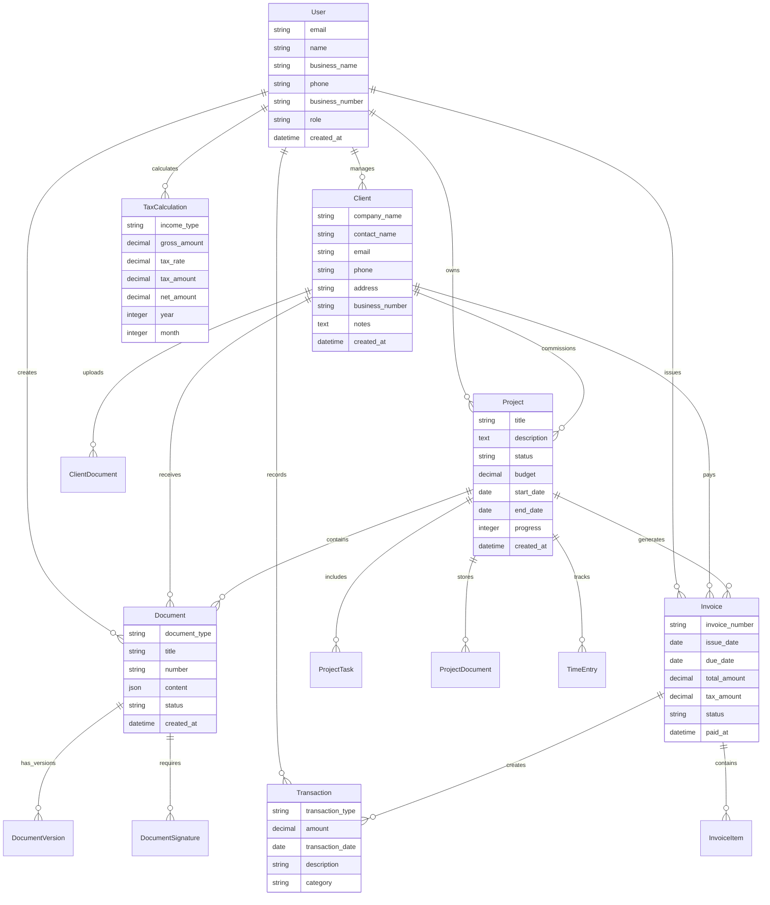

# Weave 도메인 모델 설계

## 핵심 엔티티 관계도

## 상태 정의

### Project Status
- `pending` - 진행 전
- `in_progress` - 진행 중
- `feedback` - 피드백
- `completed` - 완료
- `cancelled` - 취소됨

### Document Type
- `quote` - 견적서
- `contract` - 계약서
- `invoice` - 청구서
- `receipt` - 거래명세서

### Document Status
- `draft` - 초안
- `sent` - 발송됨
- `viewed` - 열람됨
- `signed` - 서명됨
- `cancelled` - 취소됨

### Invoice Status
- `draft` - 초안
- `issued` - 발행됨
- `paid` - 입금완료
- `overdue` - 연체
- `cancelled` - 취소됨

### Transaction Type
- `income` - 수입
- `expense` - 지출
- `tax` - 세금