# Weave ERP 시스템 - React + Next.js 아키텍처 설계

## 📋 개요

기존 Ruby on Rails 기반 설계를 React + Next.js 조합으로 변경하여 Vercel 배포에 최적화된 프리랜서 ERP 시스템 아키텍처를 설계합니다.

## 🏗️ 전체 아키텍처

```mermaid
graph TB
    Client[브라우저 클라이언트]
    
    subgraph "Vercel Platform"
        NextJS[Next.js 14 App Router]
        API[API Routes]
        Edge[Edge Functions]
    end
    
    subgraph "Supabase Backend"
        Auth[Authentication]
        DB[(PostgreSQL)]
        Storage[File Storage]
        Realtime[Real-time Subscriptions]
    end
    
    subgraph "External Services"
        OpenAI[OpenAI API]
        Email[Email Service]
        Payment[Payment Gateway]
    end
    
    Client --> NextJS
    NextJS --> API
    API --> Auth
    API --> DB
    API --> Storage
    API --> OpenAI
    API --> Email
    
    NextJS --> Edge
    Edge --> Realtime
    
    style NextJS fill:#0070f3
    style Supabase fill:#3ecf8e
    style Vercel fill:#000
```



## 🛠️ 기술 스택

### Frontend
- **Framework**: Next.js 14+ (App Router)
- **Language**: TypeScript
- **Styling**: Tailwind CSS + 기존 Weave UI Components
- **State Management**: Zustand + React Query (TanStack Query)
- **Form Handling**: React Hook Form + Zod
- **Charts**: Recharts
- **PDF Generation**: React-PDF + PDF-lib

### Backend
- **API**: Next.js API Routes
- **Database**: Supabase (PostgreSQL)
- **ORM**: Prisma
- **Authentication**: Supabase Auth
- **File Storage**: Supabase Storage
- **Real-time**: Supabase Real-time Subscriptions

### AI & External Services
- **AI**: OpenAI API + Vercel AI SDK
- **Email**: Resend 또는 SendGrid
- **Payments**: Stripe (향후 확장)

### DevOps & Monitoring
- **Deployment**: Vercel
- **Analytics**: Vercel Analytics
- **Error Tracking**: Sentry
- **Database Management**: Supabase Dashboard

## 📁 프로젝트 구조

```
weave/
├── src/
│   ├── app/                           # Next.js 14 App Router
│   │   ├── (auth)/                   # 인증 관련 페이지 그룹
│   │   │   ├── login/
│   │   │   │   └── page.tsx
│   │   │   ├── register/
│   │   │   │   └── page.tsx
│   │   │   └── layout.tsx
│   │   ├── (dashboard)/              # 메인 대시보드 그룹
│   │   │   ├── dashboard/           # 통합 대시보드
│   │   │   │   ├── page.tsx
│   │   │   │   └── components/
│   │   │   ├── projects/            # 프로젝트 관리
│   │   │   │   ├── page.tsx
│   │   │   │   ├── [id]/
│   │   │   │   └── components/
│   │   │   ├── clients/             # 클라이언트 관리
│   │   │   │   ├── page.tsx
│   │   │   │   ├── [id]/
│   │   │   │   └── components/
│   │   │   ├── documents/           # 문서 관리
│   │   │   │   ├── page.tsx
│   │   │   │   ├── templates/
│   │   │   │   ├── [type]/
│   │   │   │   └── components/
│   │   │   ├── finance/             # 재무 관리
│   │   │   │   ├── page.tsx
│   │   │   │   ├── reports/
│   │   │   │   └── components/
│   │   │   ├── settings/            # 설정
│   │   │   │   ├── page.tsx
│   │   │   │   ├── profile/
│   │   │   │   ├── billing/
│   │   │   │   └── components/
│   │   │   └── layout.tsx
│   │   ├── share/                   # 클라이언트 공유 페이지
│   │   │   ├── [token]/
│   │   │   │   ├── page.tsx
│   │   │   │   └── upload/
│   │   │   └── layout.tsx
│   │   ├── api/                     # API Routes
│   │   │   ├── auth/
│   │   │   │   ├── signup/
│   │   │   │   └── login/
│   │   │   ├── projects/
│   │   │   │   ├── route.ts
│   │   │   │   └── [id]/
│   │   │   ├── clients/
│   │   │   │   ├── route.ts
│   │   │   │   └── [id]/
│   │   │   ├── documents/
│   │   │   │   ├── route.ts
│   │   │   │   ├── templates/
│   │   │   │   ├── generate/
│   │   │   │   └── [id]/
│   │   │   ├── finance/
│   │   │   │   ├── dashboard/
│   │   │   │   ├── reports/
│   │   │   │   └── tax/
│   │   │   ├── ai/
│   │   │   │   ├── generate-document/
│   │   │   │   ├── summarize/
│   │   │   │   └── suggest/
│   │   │   ├── upload/
│   │   │   │   ├── client-docs/
│   │   │   │   └── [token]/
│   │   │   └── webhooks/
│   │   │       ├── supabase/
│   │   │       └── stripe/
│   │   ├── globals.css
│   │   ├── layout.tsx
│   │   └── page.tsx
│   ├── components/                  # 재사용 컴포넌트
│   │   ├── ui/                     # 기존 Weave UI Components
│   │   │   ├── Button.tsx
│   │   │   ├── Card.tsx
│   │   │   ├── Input.tsx
│   │   │   └── ...
│   │   ├── forms/                  # 폼 컴포넌트
│   │   │   ├── ProjectForm.tsx
│   │   │   ├── ClientForm.tsx
│   │   │   ├── DocumentForm.tsx
│   │   │   └── common/
│   │   ├── charts/                 # 차트/그래프
│   │   │   ├── RevenueChart.tsx
│   │   │   ├── ProjectStatusChart.tsx
│   │   │   └── TaxChart.tsx
│   │   ├── layout/                 # 레이아웃 컴포넌트
│   │   │   ├── Sidebar.tsx
│   │   │   ├── Header.tsx
│   │   │   ├── DashboardLayout.tsx
│   │   │   └── AuthLayout.tsx
│   │   ├── features/               # 기능별 컴포넌트
│   │   │   ├── kanban/
│   │   │   ├── document-editor/
│   │   │   ├── file-upload/
│   │   │   └── ai-assistant/
│   │   └── providers/              # Context Providers
│   │       ├── AuthProvider.tsx
│   │       ├── QueryProvider.tsx
│   │       └── ThemeProvider.tsx
│   ├── lib/                        # 유틸리티 및 설정
│   │   ├── auth.ts                # 인증 설정
│   │   ├── db.ts                  # 데이터베이스 설정 (Supabase)
│   │   ├── ai.ts                  # AI 서비스 설정 (OpenAI)
│   │   ├── storage.ts             # 파일 스토리지 설정
│   │   ├── email.ts               # 이메일 서비스 설정
│   │   ├── validations.ts         # Zod 스키마
│   │   ├── constants.ts           # 상수 정의
│   │   └── utils.ts               # 공통 유틸리티
│   ├── hooks/                      # Custom Hooks
│   │   ├── useAuth.ts
│   │   ├── useProjects.ts
│   │   ├── useClients.ts
│   │   ├── useDocuments.ts
│   │   └── useRealtime.ts
│   ├── stores/                     # Zustand Stores
│   │   ├── authStore.ts
│   │   ├── uiStore.ts
│   │   └── projectStore.ts
│   └── types/                      # TypeScript 타입 정의
│       ├── auth.ts
│       ├── project.ts
│       ├── client.ts
│       ├── document.ts
│       ├── finance.ts
│       └── database.ts
├── prisma/                         # Prisma 설정
│   ├── schema.prisma
│   ├── migrations/
│   └── seed.ts
├── public/                         # 정적 파일
│   ├── templates/                  # 문서 템플릿
│   ├── icons/
│   └── images/
├── docs/                          # 문서
│   ├── api/                       # API 문서
│   ├── deployment/                # 배포 가이드
│   └── development/               # 개발 가이드
└── tests/                         # 테스트
    ├── __tests__/
    ├── __mocks__/
    └── setup.ts
```

## 🔧 핵심 기능 아키텍처

### 1. 인증 시스템
```typescript
// lib/auth.ts
import { createClientComponentClient } from '@supabase/auth-helpers-nextjs'

export const authConfig = {
  providers: ['email', 'google', 'github'],
  redirectTo: '/dashboard',
  cookieOptions: {
    name: 'weave-auth',
    maxAge: 60 * 60 * 24 * 7, // 7 days
  }
}

// Row Level Security로 멀티테넌트 구현
// 모든 테이블에 user_id 컬럼 추가하여 데이터 격리
```

### 2. 문서 관리 시스템
```typescript
// Document Generation Pipeline
Client Request → Template Selection → AI Enhancement → PDF Generation → Storage → Sharing

// 구현 요소:
- React-PDF: PDF 컴포넌트 렌더링
- PDF-lib: PDF 조작 및 서명
- Supabase Storage: 파일 저장
- Token-based sharing: 보안 공유
```

### 3. 실시간 기능
```typescript
// Supabase Realtime Subscriptions
const subscription = supabase
  .channel('projects')
  .on('postgres_changes', {
    event: '*',
    schema: 'public',
    table: 'projects',
    filter: `user_id=eq.${userId}`
  }, handleProjectUpdate)
  .subscribe()

// 실시간 업데이트 대상:
- 프로젝트 상태 변경
- 새 메시지/알림
- 문서 업로드 상태
- 결제 상태 변경
```

### 4. AI 통합
```typescript
// AI Document Generation
import { OpenAI } from 'openai'
import { streamObject } from 'ai'

export async function generateDocument(type: DocumentType, data: ProjectData) {
  const prompt = buildPrompt(type, data)
  
  return streamObject({
    model: openai('gpt-4-turbo'),
    schema: documentSchema,
    prompt,
  })
}

// 기능:
- 문서 초안 자동 생성
- 이메일/회의록 요약
- 데이터 기반 제안
```

## 🔒 보안 아키텍처

### 1. 데이터 보안
- **Row Level Security (RLS)**: Supabase에서 사용자별 데이터 격리
- **API 인증**: 모든 API Route에 인증 미들웨어
- **파일 접근 제어**: 토큰 기반 파일 액세스

### 2. 클라이언트 보안
- **CSRF 보호**: Next.js 내장 보호
- **XSS 방지**: 입력값 검증 및 이스케이프
- **업로드 검증**: 파일 타입 및 크기 제한

```typescript
// middleware.ts
import { createMiddlewareClient } from '@supabase/auth-helpers-nextjs'

export async function middleware(req: NextRequest) {
  const res = NextResponse.next()
  const supabase = createMiddlewareClient({ req, res })
  
  const { data: { user } } = await supabase.auth.getUser()
  
  if (!user && req.nextUrl.pathname.startsWith('/dashboard')) {
    return NextResponse.redirect(new URL('/login', req.url))
  }
  
  return res
}
```

## 🚀 성능 최적화

### 1. 렌더링 최적화
- **App Router**: Server Components 우선 사용
- **Streaming**: 페이지 로딩 최적화
- **Code Splitting**: 동적 import로 번들 크기 최소화

### 2. 데이터 관리
- **React Query**: 서버 상태 캐싱 및 동기화
- **Optimistic Updates**: 즉각적인 UI 반응
- **Background Refetch**: 백그라운드 데이터 갱신

### 3. 에셋 최적화
- **Next.js Image**: 자동 이미지 최적화
- **Font Optimization**: Google Fonts 최적화
- **Bundle Analysis**: webpack-bundle-analyzer

## 📊 모니터링 및 분석

### 1. 성능 모니터링
- **Vercel Analytics**: 웹 바이탈 추적
- **Real User Monitoring**: 실제 사용자 성능 측정
- **Core Web Vitals**: LCP, FID, CLS 추적

### 2. 에러 추적
- **Sentry**: 런타임 에러 캐치 및 보고
- **Error Boundaries**: React 컴포넌트 에러 처리
- **API Error Handling**: 구조화된 에러 응답

### 3. 비즈니스 메트릭
- **사용자 행동 분석**: 페이지 조회, 기능 사용률
- **전환율 추적**: 가입, 문서 생성, 결제
- **성능 지표**: 문서 생성 시간, 업로드 성공률

## 🔄 개발 페이즈 로드맵

### Phase 1: MVP (4-6주)
**목표**: 핵심 기능으로 실용적인 프로토타입 완성

**기능**:
- ✅ 사용자 인증 (회원가입, 로그인, 프로필)
- ✅ 프로젝트 CRUD (생성, 조회, 수정, 삭제)
- ✅ 클라이언트 관리 (기본 정보, 연락처)
- ✅ 기본 문서 생성 (템플릿 기반 견적서, 계약서)
- ✅ 간단한 대시보드 (프로젝트 현황, 수입 개요)

**기술 스택**:
- Next.js 14 + TypeScript
- Supabase (Auth + Database)
- Prisma ORM
- Tailwind CSS + Weave UI Components

### Phase 2: 문서 시스템 고도화 (4-6주)
**목표**: 문서 관리의 완전한 워크플로우 구현

**기능**:
- ✅ PDF 생성 및 미리보기
- ✅ 전자서명 기능
- ✅ 클라이언트 문서 공유 시스템 (토큰 기반 업로드)
- ✅ 프로젝트 칸반 보드 (드래그 앤 드롭)
- ✅ 재무 관리 (입금 추적, 미수금 관리)
- ✅ 이메일 알림 시스템

**추가 기술**:
- React-PDF + PDF-lib
- Supabase Storage
- React DnD (칸반 보드)
- Resend (이메일)

### Phase 3: AI 통합 및 차별화 (6-8주)
**목표**: AI로 업무 효율성 극대화

**기능**:
- 🤖 AI 문서 초안 생성 (OpenAI GPT-4)
- 🤖 이메일/회의록 스마트 요약
- 🤖 데이터 기반 가격 제안
- 📊 고급 리포팅 및 분석
- 🔔 스마트 알림 및 리마인더
- 💾 자동 백업 및 아카이빙

**추가 기술**:
- OpenAI API + Vercel AI SDK
- Recharts (고급 차트)
- Background Jobs (Vercel Cron)

### Phase 4: 최적화 및 확장 (4-6주)
**목표**: 사용자 피드백 반영 및 서비스 안정화

**기능**:
- ⚡ 성능 최적화 (페이지 로드 속도, 반응성)
- 📱 모바일 반응형 완성
- 🔍 고급 검색 및 필터링
- 🎨 UI/UX 개선
- 🔐 보안 강화
- 📈 비즈니스 인텔리전스 대시보드

**최적화 영역**:
- Core Web Vitals 개선
- 접근성 (WCAG 2.1)
- SEO 최적화
- 국제화 (i18n) 준비

## 🌐 Vercel 배포 아키텍처

### 1. 배포 환경
```yaml
Production:
  - Branch: main
  - Domain: weave.app
  - Environment: production
  - Database: Supabase Production

Staging:
  - Branch: develop
  - Domain: staging.weave.app
  - Environment: staging
  - Database: Supabase Staging

Preview:
  - Branch: feature/*
  - Domain: pr-123.weave.app
  - Environment: preview
  - Database: Supabase Staging
```

### 2. 환경 변수 관리
```bash
# Vercel Environment Variables
NEXT_PUBLIC_SUPABASE_URL=
NEXT_PUBLIC_SUPABASE_ANON_KEY=
SUPABASE_SERVICE_ROLE_KEY=
OPENAI_API_KEY=
RESEND_API_KEY=
NEXT_PUBLIC_APP_URL=
DATABASE_URL=
```

### 3. 자동화된 워크플로우
- **PR 생성**: 자동 Preview 배포
- **메인 브랜치 머지**: 자동 Production 배포
- **데이터베이스 마이그레이션**: GitHub Actions 연동
- **타입 체크**: 빌드 시 자동 검증

## 📝 다음 단계

1. **Prisma 스키마 설계** - 도메인 모델 기반 데이터베이스 설계
2. **UI 컴포넌트 확장** - 기존 Weave UI에 ERP 특화 컴포넌트 추가
3. **API 설계** - RESTful API 엔드포인트 상세 설계
4. **개발 환경 셋업** - Supabase 프로젝트 생성 및 초기 설정

이 아키텍처는 확장성, 성능, 사용자 경험을 균형 있게 고려하여 설계되었으며, Vercel 플랫폼의 장점을 최대한 활용할 수 있도록 구성되었습니다.