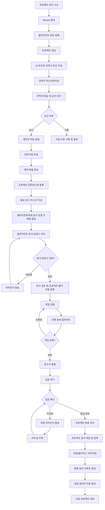

# 사용자 시나리오 룰

## 페르소나

### 김민수 (30세, 웹 개발 프리랜서, 경력 4년)
- **직업**: 풀스택 웹 개발자
- **경력**: 4년차 프리랜서
- **월 평균 수입**: 250만원
- **작업 환경**: 홈오피스, 개인 작업
- **현재 고객**: 스타트업 3곳, 중소기업 2곳
- **주요 고충**: 
  - 매월 10여개의 견적서/계약서 작성
  - Excel로 관리하는 프로젝트 일정 혼란
  - 미수금 추적의 어려움
  - 세금 계산 및 신고 준비의 복잡함
  - **클라이언트 자료 수집의 번거로움 (이메일, 메신저 등 분산된 채널)**
  - **프로젝트 완료 후 관련 문서 유실 위험**

## 정황

김민수는 최근 프로젝트가 증가하면서 업무량이 급격히 늘어났다. 특히 행정 업무에 하루 3-4시간을 소모하고 있어 실제 개발 작업 시간이 부족한 상황이다. 현재 5개 클라이언트와 동시에 7개 프로젝트를 진행 중이며, 각각 다른 단계(견적, 진행, 완료, 정산)에 있어 관리가 복잡하다.

## 사용자의 목표

1. **시간 효율성**: 행정 업무 시간을 70% 단축하여 개발 작업에 집중
2. **수입 안정성**: 미수금을 30% 빠르게 회수하여 현금 흐름 개선
3. **업무 체계화**: 모든 프로젝트와 클라이언트 정보를 한 곳에서 통합 관리
4. **세무 간소화**: 종합소득세 신고 준비 과정을 자동화
5. **문서 관리 효율성**: 클라이언트와의 문서 교환을 간소화하고 체계적 보관
6. **프로젝트 자료 보존**: 완료된 프로젝트 자료의 유실 방지 및 백업

## 사용자의 작업 및 행동

### 1. 일일 업무 시작
- 오전 9시 Weave 대시보드 접속
- 당일 할 일과 마감 임박 프로젝트 확인
- 미수금 현황 및 입금 예정일 체크

### 2. 신규 프로젝트 대응
- 클라이언트 정보 등록 및 프로젝트 생성
- AI 비서를 활용한 견적서 초안 작성
- 템플릿 기반 계약서 생성 및 전자서명 요청

### 3. 진행 중인 프로젝트 관리
- 칸반 보드에서 프로젝트 상태 업데이트
- 완료된 작업에 대한 청구서 발행
- 클라이언트와의 커뮤니케이션 로그 기록

### 4. 정산 및 세무 관리
- 월말 수입/지출 현황 리포트 확인
- 세금계산서 발행 및 예상 세액 확인
- 종합소득세 신고 데이터 자동 정리

### 5. 클라이언트 문서 수집 및 관리
- 프로젝트 시작 시 필요 자료 리스트 작성
- 클라이언트에게 문서 요청 이메일 자동 발송
- 클라이언트 문서 업로드 현황 실시간 모니터링
- 업로드된 문서 검토 및 추가 요청사항 전달

### 6. 프로젝트 완료 후 아카이빙
- 프로젝트 완료 시 관련 문서 일괄 검토
- 클라이언트 제공 자료 + 결과물 + 소통 기록 백업
- ZIP 파일로 압축하여 로컬 및 클라우드 저장
- 향후 참조 및 포트폴리오 활용을 위한 정리

## 시나리오

### 상세 시나리오

#### 월요일 오전 (신규 프로젝트 문의)
1. **09:00** - Weave 대시보드 접속, 주간 할 일 확인
2. **09:15** - 새로운 프로젝트 문의 이메일 확인
3. **09:30** - 클라이언트 정보 등록 (회사명: ABC 스타트업, 담당자: 이영희)
4. **09:45** - 프로젝트 생성 ("쇼핑몰 웹사이트 개발", 예상 기간: 4주, 예산: 300만원)
5. **10:00** - AI 비서에게 "쇼핑몰 웹사이트 개발 견적서 초안 작성" 요청
6. **10:15** - 생성된 초안을 검토하고 개인화 수정
7. **10:30** - 견적서 발송 및 알림 설정

#### 수요일 오후 (프로젝트 진행 관리)
1. **14:00** - 진행 중인 프로젝트 3개 상태 확인
2. **14:15** - "XYZ 회사 홈페이지" 프로젝트를 '피드백' 단계로 이동
3. **14:30** - "123 쇼핑몰" 프로젝트 완료하여 청구서 발행
4. **14:45** - 클라이언트와의 회의록을 AI 비서가 요약하여 할 일 목록 추출
5. **15:00** - 다음 주 마감 예정 프로젝트 2개 진행 상황 점검

#### 화요일 오전 (프로젝트 시작 후 문서 수집)
1. **10:00** - DEF 회사 브랜딩 프로젝트 계약 완료 확인
2. **10:15** - 필요 문서 리스트 작성 ("로고 시안, 브랜드 가이드라인, 경쟁사 분석 자료, 타겟 고객 정보")
3. **10:30** - 문서 요청 이메일 템플릿 커스터마이징 후 클라이언트에게 발송
4. **10:45** - 고유 업로드 링크 생성 및 만료일 설정 (30일)
5. **14:30** - 클라이언트 문서 업로드 알림 수신 (4개 파일 업로드 완료)
6. **14:45** - 업로드된 문서 검토 및 "DEF_브랜딩_프로젝트" 폴더에 자동 분류 확인

#### 월말 (정산 및 세무 관리)
1. **31일 18:00** - 월간 수익 리포트 자동 생성 확인
2. **18:15** - 미수금 현황 점검 (총 150만원, 평균 회수 기간 12일)
3. **18:30** - 종합소득세 신고용 데이터 자동 정리 확인
4. **18:45** - 다음 달 예상 수입 및 세금 계획 수립

#### 프로젝트 완료 시 (문서 백업 및 아카이빙)
1. **16:00** - "GHI 쇼핑몰 프로젝트" 최종 완료 처리
2. **16:15** - 프로젝트 백업 옵션 선택: 클라이언트 제공 문서 + 결과물 + 커뮤니케이션 로그
3. **16:30** - "GHI_쇼핑몰_프로젝트_2024_완료.zip" 파일 자동 생성 (총 45개 파일, 180MB)
4. **16:45** - 로컬 다운로드 및 구글 드라이브 자동 백업 완료
5. **17:00** - 백업 완료 확인서 클라이언트에게 메일 발송

## 기대효과 또는 결과

### 정량적 결과
- **시간 절약**: 행정 업무 시간 70% 단축 (4시간 → 1.2시간)
- **수입 증대**: 개발 작업 시간 증가로 월 수입 30% 향상 (250만원 → 325만원)
- **미수금 개선**: 미수금 회수 기간 30% 단축 (18일 → 12일)
- **프로젝트 효율**: 동시 진행 가능 프로젝트 40% 증가 (5개 → 7개)
- **문서 수집 효율**: 클라이언트 자료 수집 시간 60% 단축 (5일 → 2일)
- **문서 유실률 감소**: 프로젝트 관련 문서 유실률 95% 감소
- **백업 시간**: 프로젝트 완료 후 자료 정리 시간 80% 단축 (2시간 → 24분)

### 정성적 결과
- **스트레스 감소**: 체계적인 업무 관리로 정신적 부담 해소
- **프로페셔널 이미지**: 깔끔한 문서와 신속한 대응으로 클라이언트 만족도 향상
- **데이터 기반 의사결정**: 명확한 수익성 분석을 통한 프로젝트 선택 기준 확립
- **사업 확장성**: 체계화된 시스템을 바탕으로 팀 확장 및 사업 성장 준비 완료
- **클라이언트 관계 개선**: 편리한 문서 공유 시스템으로 클라이언트 협업 만족도 증가
- **업무 연속성 확보**: 체계적인 문서 보관으로 프로젝트 히스토리 및 노하우 축적
- **법적 안정성**: 모든 프로젝트 문서의 완전한 보존으로 분쟁 시 증빙 자료 확보
